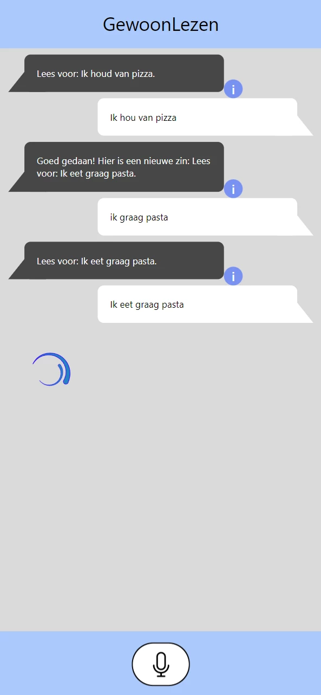

Tijdens TLE2 (Technological learning environment 2) kreeg ik een nieuw team om een project mee te maken. Wij kregen als team de taak om een SDG uit te kiezen en een interactieve oplossing te verzinnen die de SDG voldoet. Een Sustainable Development Goal (SDG) is een specifiek doel of target vastgesteld door de Verenigde Naties, om wereldwijde uitdagingen aan te pakken en een meer duurzame toekomst te behalen. Deze oplossing moest gebruik maken van 1 of meerdere AI technologieen. De komende 6 maanden zijn wij toen aan de slag gegaan om de SDG te behalen.

Het SDG wat we hebben gekozen is Quality Education: Zorg voor inclusief en rechtvaardig onderwijs van hoge kwaliteit en bevorder levenslang leren voor iedereen. En na enkele brainstorms, onderzoek een "google design sprint" en heel wat programmeren, is GewoonLezen het resultaat.

GewoonLezen is een web app voor zowel mobile als desktop, met als doel de leesvaardigheid van laag geleterde te verbeteren. In de app krijgen gebruikers teksten die zij moeten voorlezen, de app herkend vervolgens wat er gelezen is en geeft dan feedback. De teksten die voorgelezen moeten worden zijn gegeneerd op basis van:

- Het leesniveau van de gebruiker.
- Vorige fouten van de gebruiker.
- Het onderwerp van de vorige zinnen.

De app maakt gebruik van Text-to-speech, speech recognition, en GPT-3.5 en is gebouwd met React en Typescript voor de front-end en Next.js samen met de OpenAI API voor de back-end. Mijn rol tijdens dit project was om de app te ontwerpen en te bouwen.

Klik [hier](https://cmgt.hr.nl/projecten/gewoonlezen) voor meer informatie, en een uitleg video van de app.

